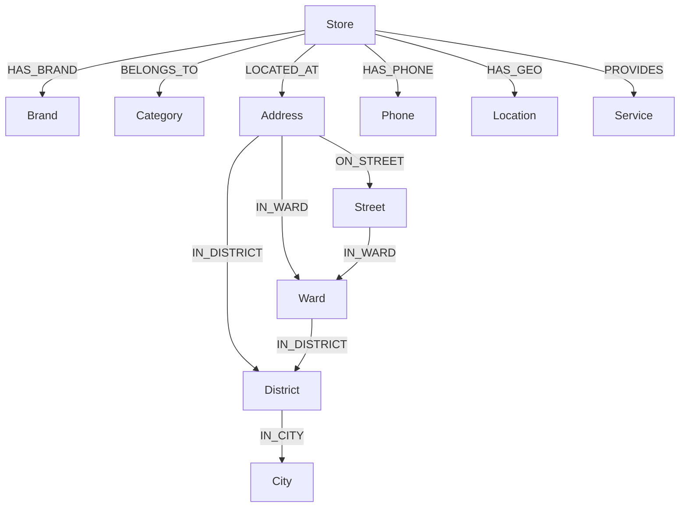

# Đồ Thị Tri Thức Biển Hiệu Đường Phố (Sign Knowledge Graph) - Hướng Dẫn Kỹ Thuật

Tài liệu này giới thiệu tổng quan, chi tiết về các thực thể, mối quan hệ và hướng dẫn tương tác với hệ thống Đồ thị tri thức biển hiệu cửa hàng đường phố Ninh Kiều (Sign KG) được hiển thị trên file tương tác độc lập [signkg_graph.html](file:///d:/LuanVan/signkg_graph.html).

---

## 1. Giới thiệu chung
Đồ thị Tri thức Biển hiệu (Sign Knowledge Graph) là một mô hình mạng lưới liên kết (Graph Database/Knowledge Graph) mô hình hóa cấu trúc thông tin của **302 cửa hàng/biển hiệu** tại địa bàn **Quận Ninh Kiều, Thành phố Cần Thơ**. 

Đồ thị được xây dựng tự động từ dữ liệu đã chuẩn hóa (nhờ vào định vị GPS và giải thuật làm sạch địa chỉ nâng cao bằng Nominatim API), biểu diễn các mối quan hệ chặt chẽ giữa cửa hàng với thương hiệu, danh mục kinh doanh và hệ thống phân cấp địa giới hành chính (City -> District -> Ward -> Street -> Address).

---

## 2. Sơ đồ Thực thể (Entity Schema)

Đồ thị gồm có **11 thực thể (Node Groups)** chính:

| Tên Thực Thể (Group) | Ý Nghĩa | Ví Dụ Minh Họa |
| :--- | :--- | :--- |
| **Store** | Đại diện cho thực thể cửa hàng vật lý (mã định danh duy nhất như `S1`, `S2`). | `S104`, `S194` |
| **Brand** | Tên thương hiệu, biển hiệu của cửa hàng. | `Xôi Gà Hữu Phước`, `Nhat Tin Logistics` |
| **Category** | Danh mục ngành nghề hoặc loại hình kinh doanh. | `Cửa hàng tiện lợi`, `Quán ăn`, `Đồ gia dụng` |
| **Address** | Địa chỉ đầy đủ dạng chuỗi đã chuẩn hóa của cửa hàng. | `267 Đường Dân Cư Số 5, , Quận Ninh Kiều, Thành phố Cần Thơ` |
| **Phone** | Số điện thoại liên hệ của cửa hàng (nếu có). | `0907123456` |
| **Location** | Tọa độ GPS địa lý (Vĩ độ - Latitude, Kinh độ - Longitude). | `10.023001219975301, 105.7719254560389` |
| **Service** | Các dịch vụ đi kèm của cửa hàng (ví dụ: giao hàng, wifi miễn phí,...). | *Hiện tại dữ liệu mẫu đang để trống* |
| **Street** | Tên tuyến đường chính thống đã được bóc tách và làm sạch hoàn toàn. | `Đường Nguyễn Văn Cừ`, `Đường 30 Tháng 4` |
| **Ward** | Phường hành chính nơi cửa hàng tọa lạc. | `Phường An Khánh`, `Phường Tân An` |
| **District** | Quận hành chính chủ quản (trong đồ thị này là **Quận Ninh Kiều**). | `Quận Ninh Kiều` |
| **City** | Thành phố trung ương chủ quản (trong đồ thị này là **Thành phố Cần Thơ**). | `Thành phố Cần Thơ` |

---

## 3. Các Mối Quan Hệ Giữa Các Thực Thể (Relationships / Edges)

Mỗi quan hệ (cạnh nối) trong đồ thị có hướng (Directed Arrow) để thể hiện ngữ nghĩa cấu trúc thông tin:

### Chi tiết ý nghĩa các liên kết:
* **`Store -[HAS_BRAND]-> Brand`**: Liên kết cửa hàng cụ thể với thương hiệu hiển thị trên biển hiệu ocr.
* **`Store -[BELONGS_TO]-> Category`**: Phân loại cửa hàng vào các nhóm ngành cụ thể để phục vụ thống kê, tìm kiếm.
* **`Store -[LOCATED_AT]-> Address`**: Liên kết cửa hàng tới địa chỉ văn bản đầy đủ.
* **`Store -[HAS_PHONE]-> Phone`**: Liên kết thông tin liên lạc (số điện thoại) được ocr phát hiện.
* **`Store -[HAS_GEO]-> Location`**: Định vị cửa hàng trên hệ tọa độ bản đồ GIS.
* **`Address -[ON_STREET]-> Street`**: Bóc tách mối quan hệ địa giới hành chính - địa chỉ nằm trên tuyến đường nào.
* **`Address -[IN_WARD]-> Ward`**: Địa chỉ thuộc địa phận quản lý hành chính của Phường nào.
* **`Street -[IN_WARD]-> Ward`**: Tuyến đường đi qua địa bàn Phường tương ứng.
* **`Ward -[IN_DISTRICT]-> District`**: Phân cấp hành chính cấp Phường trực thuộc Quận.
* **`District -[IN_CITY]-> City`**: Phân cấp hành chính cấp Quận trực thuộc Thành phố.

---

## 4. Các Tính Năng Tương Tác Trên Đồ Thị

Đồ thị được tích hợp sẵn hai bảng điều khiển tương tác mạnh mẽ được nhúng trực tiếp bằng Javascript ngay trên đầu trang đồ thị:

### A. 🔍 Bộ Lọc Địa Chỉ Tri Thức (Dropdowns)
* **Quận/Huyện (District):** Cho phép bạn lọc tất cả cửa hàng nằm trong Quận được chọn (mặc định chỉ có Quận Ninh Kiều).
* **Phường/Xã (Ward):** Dropdown này sẽ tự động thay đổi dựa trên Quận bạn chọn. Cho phép bạn thu hẹp đồ thị về phạm vi một Phường cụ thể (ví dụ: *Phường An Khánh* hoặc *Phường Tân An*).
* **Đường (Street):** Lọc nhanh tất cả các cửa hàng nằm trên một tuyến đường chính đã được chuẩn hóa (ví dụ: *Đường Nguyễn Văn Cừ*, *Đường 30 Tháng 4*,...).
* **Nút Xóa Bộ Lọc (Reset):** Phục hồi đồ thị về trạng thái ban đầu hiển thị đầy đủ tất cả các nút.

### B. 🎨 Bộ Lọc Thuộc Tính Hiển Thị (Checkboxes)
* Nằm ở dòng thứ 2 ngay bên dưới bộ lọc địa chỉ.
* Cho phép bạn **bật/tắt (Check/Uncheck)** hiển thị các nhóm nút thuộc tính cụ thể.
* **Ví dụ ứng dụng:**
  * Nếu bạn chỉ muốn quan tâm đến **Thương hiệu** và **Ngành hàng** của cửa hàng mà không muốn màn hình bị rối bởi các nút tọa độ hay số điện thoại, bạn có thể **bỏ tích** các ô: *Địa chỉ, Tọa độ, Điện thoại, Thành phố, Quận/Huyện, Dịch vụ*.
  * Đồ thị sẽ lập tức ẩn các nút thuộc nhóm bị tắt đi một cách trực quan giúp bạn tập trung phân tích tốt nhất.

---

## 5. Công Nghệ Xây Dựng
* **Backend logic:** Python sử dụng thư viện `networkx` để dựng cấu trúc đồ thị topo mạng, `psycopg2` để lấy dữ liệu từ PostgreSQL GIS, và `pyvis` để xuất đồ thị sang HTML/Javascript.
* **Frontend rendering:** Thư viện **Vis.js Network** chịu trách nhiệm dựng đồ thị canvas 2D tương tác thời gian thực với giải thuật vật lý thông minh (Physics Engine) tự động giãn cách các nút để tránh đè lấp lên nhau.
