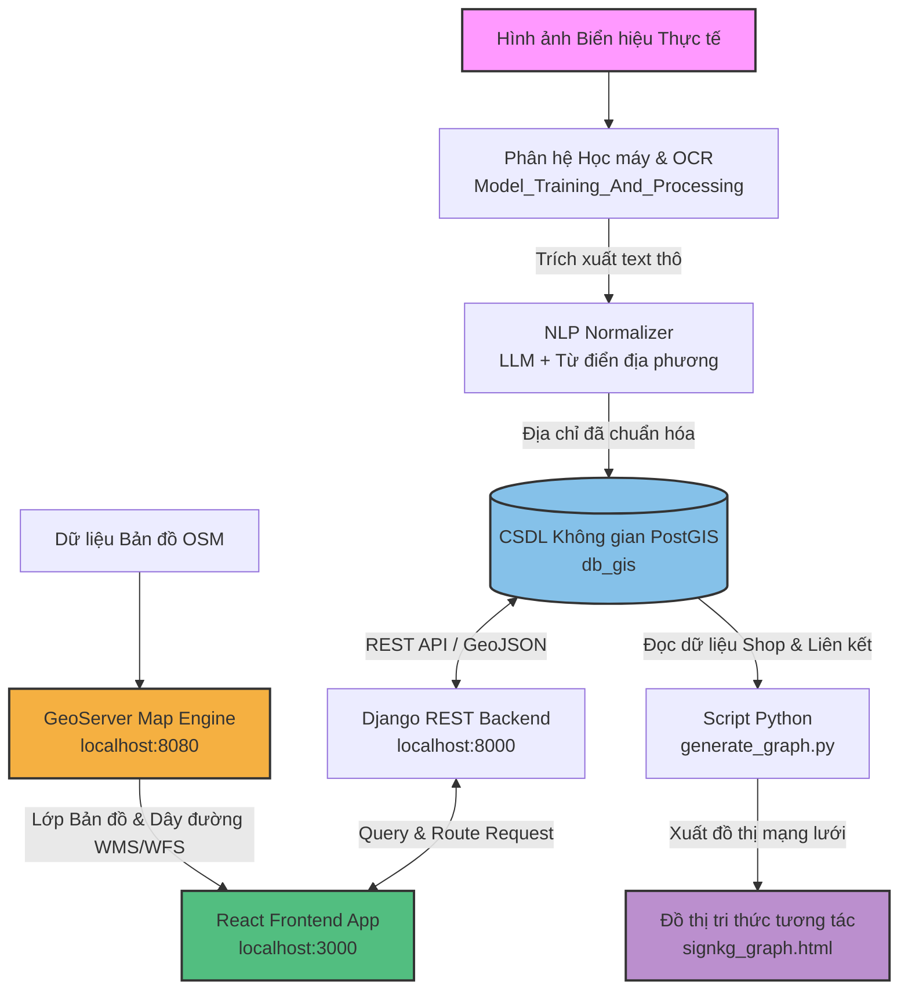

# Hệ Thống Bản Đồ Số Web GIS & Đồ Thị Tri Thức Biển Hiệu Cửa Hàng
## (Development of an Intelligent Store Mapping System Based on Information Extraction from Signboard)

Chào mừng bạn đến với kho lưu trữ mã nguồn của đề tài nghiên cứu và phát triển **"Hệ thống Bản đồ số Web GIS tích hợp Đồ thị Tri thức phục vụ chuẩn hóa, quản lý dữ liệu biển hiệu cửa hàng tại quận Ninh Kiều, Cần Thơ"**.

Dự án này là giải pháp toàn diện từ đầu-đến-cuối (End-to-End): bắt đầu từ việc thu thập hình ảnh biển hiệu cửa hàng thực tế, nhận diện và trích xuất chữ viết (OCR), chuẩn hóa và làm sạch dữ liệu địa chỉ bằng xử lý ngôn ngữ tự nhiên (NLP) với LLM và API bản đồ địa lý, lưu trữ vào cơ sở dữ liệu không gian PostGIS, phục vụ hiển thị bản đồ tương tác (Web GIS) cùng tính năng định tuyến lộ trình thông minh, và cuối cùng là mô hình hóa tri thức liên kết dưới dạng Đồ thị tri thức (Knowledge Graph - SignKG).

---

## 🗺️ Tổng Quan Kiến Trúc Hệ Thống (System Architecture)

Sơ đồ dưới đây thể hiện luồng xử lý dữ liệu và cách các thành phần trong hệ thống kết nối với nhau:



## 📁 Cấu Trúc Thư Mục Dự Án (Repository Structure)

Dự án được phân chia một cách khoa học thành các thư mục và phân vùng lớn chính như sau:

```plaintext
d:\LuanVan\
├── Documents/                       # Tài liệu nghiên cứu & Thuyết minh đề tài
│   ├── Doc.docx                    # Bản thảo Đề tài Nghiên cứu chi tiết (Word format)
│   └── Doc_2.pdf                   # Tài liệu báo cáo chính thức và các Phụ lục (PDF format)
│
├── Model_Training_And_Processing/  # Phân hệ Học máy & Xử lý OCR
│   ├── Application_Version_8.py     # Ứng dụng chính nhận diện & ocr biển hiệu
│   ├── tools/                       # Các công cụ chuẩn hóa thô ban đầu
│   └── utils/                       # NLP Normalizer sử dụng LLM & Từ điển
│
├── Web_GIS_App/                    # Phân hệ Ứng dụng Bản đồ Số Web GIS
│   ├── Sys/
│   │   ├── frontend/               # Frontend ReactJS + Mapbox GL GIS
│   │   └── backend/                # Backend Django REST Framework + PostgreSQL/PostGIS
│   │
│   └── geoserver-3.0.0/            # Máy chủ chia sẻ bản đồ địa lý GeoServer
│
└── Graph_Visualization/             # Phân hệ Đồ thị Tri thức Độc lập (Knowledge Graph)
    ├── generate_graph.py            # Script tự động lấy dữ liệu từ DB & dựng đồ thị
    ├── signkg_graph.html            # Đồ thị tri thức biển hiệu tương tác 2D trực quan
    └── graph_documentation.md       # Tài liệu kỹ thuật chi tiết về thực thể & liên kết
```

---

## 📁 Chi Tiết các Phân Hệ và Tài Liệu


### 1. 📄 Tài Liệu Nghiên Cứu (`Documents/`)
* **Nhiệm vụ:** Lưu trữ các sản phẩm học thuật, thuyết minh đề tài nghiên cứu khoa học.
* **Các tệp quan trọng:**
  * [Doc.docx](file:///d:/LuanVan/Documents/Doc.docx): Bản thuyết minh đề tài nghiên cứu khoa học chi tiết (định dạng Word).
  * [Doc_2.pdf](file:///d:/LuanVan/Documents/Doc_2.pdf): Bản báo cáo nghiệm thu chính thức và phụ lục liên quan (định dạng PDF).

### 2. 🧠 Phân Hệ Học Máy & OCR (`Model_Training_And_Processing/`)
* **Nhiệm vụ:** Phát hiện khu vực chứa chữ trên biển hiệu (Text Detection) và nhận diện văn bản (Text Recognition).
* **Các thành phần cốt lõi:**
  * **Nhận diện biển hiệu:** Sử dụng các mô hình học sâu hiện đại (YOLOv8, PaddleOCR) để phát hiện và bóc tách chữ từ ảnh chụp biển hiệu (`Application_Version_8.py`).
  * **Công cụ chuẩn hóa và làm sạch địa chỉ:**
    * [llm_normalizer.py](file:///d:/LuanVan/Model_Training_And_Processing/utils/llm_normalizer.py): Áp dụng mô hình ngôn ngữ lớn (LLM) tích hợp với từ điển địa danh chi tiết của Cần Thơ (`can_tho_dictionary.md`) để tự động chuyển đổi các địa chỉ bị lỗi OCR thành địa chỉ hành chính hợp lệ.
    * [normalize_addresses.py](file:///d:/LuanVan/Model_Training_And_Processing/tools/normalize_addresses.py): Script thực hiện chuẩn hóa địa chỉ hàng loạt từ cơ sở dữ liệu.
  * **Lưu ý:** Các file trọng số mô hình lớn (`.pt`, `.pth`, `.zip`) được cấu hình bỏ qua trong `.gitignore` để tối ưu dung lượng Git.

### 3. 🌐 Ứng Dụng Bản Đồ Số Web GIS (`Web_GIS_App/`)
* **Nhiệm vụ:** Xây dựng cổng thông tin địa lý tương tác đầy đủ tính năng phục vụ người dùng tìm kiếm cửa hàng và định tuyến đi lại.
* **Kiến trúc thành phần:**
  * **Backend (`Sys/backend/`):** API viết bằng Django REST Framework & Django REST Framework GIS. Tích hợp giải thuật tìm đường đi ngắn nhất (Dijkstra, A*) chạy trên cấu trúc mạng lưới giao thông đường bộ được nhập từ OpenStreetMap (OSM).
  * **Frontend (`Sys/frontend/`):** Ứng dụng Single Page App ReactJS, tích hợp `react-leaflet` và OpenLayers để vẽ giao diện bản đồ, lớp ranh giới phường và hiển thị các lớp phủ dữ liệu.
  * **GeoServer (`geoserver-3.0.0/`):** Đóng vai trò là Map Server cục bộ (được cấu hình bỏ qua trong `.gitignore` vì dung lượng lớn và mang tính chất môi trường local).

### 4. 📊 Đồ Thị Tri Thức Biển Hiệu (`Graph_Visualization/`)
* **Nhiệm vụ:** Trực quan hóa tri thức kết nối đa chiều giữa Cửa hàng, Thương hiệu, Phân ngành dịch vụ, Tuyến đường, Phường hành chính dưới dạng mạng lưới Đồ thị Tri thức (Sign Knowledge Graph).
* **Các sản phẩm chính:**
  * [generate_graph.py](file:///d:/LuanVan/Graph_Visualization/generate_graph.py): Script Python kết nối CSDL PostGIS, trích xuất cấu trúc quan hệ và xuất ra file HTML tương tác.
  * [signkg_graph.html](file:///d:/LuanVan/Graph_Visualization/signkg_graph.html): Giao diện đồ thị tương tác 2D sắc nét sử dụng thư viện Vis.js. Hỗ trợ tìm kiếm, lọc phân tầng địa giới hành chính (`Quận -> Phường -> Tuyến đường`) và bật/tắt các loại thuộc tính liên kết bằng checkbox trực quan.
  * [graph_documentation.md](file:///d:/LuanVan/Graph_Visualization/graph_documentation.md): Tài liệu đặc tả kỹ thuật chi tiết về cấu trúc các nút và các liên kết trong đồ thị.

---

## 🛠️ Hướng Dẫn Cài Đặt & Chạy Môi Trường Local từ A - Z

Vui lòng làm theo thứ tự các bước dưới đây để thiết lập toàn bộ hệ thống trên máy tính cá nhân.

### Bước 1: Khởi Tạo Cơ Sở Dữ Liệu Không Gian (PostgreSQL / PostGIS)
Hệ thống sử dụng PostgreSQL tích hợp extension PostGIS để quản lý dữ liệu tọa độ địa lý của các cửa hàng.

1. Bạn có thể sử dụng Docker để tạo nhanh database Postgres bằng tệp `docker-compose.yml` có sẵn tại thư mục Backend:
   ```bash
   cd Web_GIS_App/Sys/backend
   docker-compose up -d db
   ```
2. Khôi phục cơ sở dữ liệu từ tệp sao lưu đã được chuẩn hóa `dump-gisdb-normalized.sql` có trong thư mục gốc dự án:
   ```bash
   # Khôi phục dữ liệu vào database (Thay đổi port, user, dbname cho phù hợp với môi trường của bạn)
   pg_restore -h localhost -p 5433 -U myuser -d mydb -v dump-gisdb-normalized.sql
   ```
3. Đảm bảo extension không gian đã được kích hoạt trong CSDL:
   ```sql
   CREATE EXTENSION IF NOT EXISTS postgis;
   ```

### Bước 2: Thiết Lập & Khởi Chạy Backend (Django REST)
1. Truy cập thư mục backend và tạo môi trường ảo Python:
   ```bash
   cd Web_GIS_App/Sys/backend
   python -m venv venv
   ```
2. Kích hoạt môi trường ảo:
   * Trên Windows: `.\venv\Scripts\activate`
   * Trên macOS/Linux: `source venv/bin/activate`
3. Cài đặt các gói thư viện Python bắt buộc:
   ```bash
   pip install -r requirements.txt
   ```
4. Tạo tệp `.env` cấu hình trong thư mục Backend:
   ```env
   MAPTILER_KEY=your_maptiler_api_key
   SECRET_KEY=your_django_secret_key
   DEBUG=True
   ```
5. Thực hiện migration và tạo tài khoản quản trị (Admin):
   ```bash
   python manage.py makemigrations
   python manage.py migrate
   python manage.py createsuperuser
   ```
6. Bật server phát triển:
   ```bash
   python manage.py runserver
   ```
   * Cổng API Backend sẽ chạy tại: `http://127.0.0.1:8000`
   * Cổng Admin Dashboard: `http://127.0.0.1:8000/admin/`

### Bước 3: Thiết Lập Máy Chủ Bản Đồ GeoServer
Bản đồ không gian của ứng dụng lấy dữ liệu tuyến đường đi của OpenStreetMap và ranh giới thông qua GeoServer.
1. Cài đặt môi trường chạy Java (JRE 8 hoặc JRE 11).
2. Vào thư mục `Web_GIS_App/geoserver-3.0.0/bin/` và chạy tệp:
   * Windows: `startup.bat`
   * Linux/macOS: `./startup.sh`
3. Truy cập bảng điều khiển GeoServer tại `http://localhost:8080/geoserver` (tài khoản mặc định: `admin` / mật khẩu: `geoserver`).
4. Xuất bản các lớp dữ liệu (Publish Layers):
   * Tạo Workspace: đặt tên là `cantho_map`.
   * Liên kết Store kết nối đến PostgreSQL chứa dữ liệu OSM.
   * Publish hai lớp dữ liệu bản đồ nền quan trọng: `planet_osm_line` (dữ liệu mạng lưới giao thông phục vụ vẽ đường đi) và `ranh_gioi_can_tho` (dữ liệu vùng đa giác ranh giới hành chính các phường thuộc quận Ninh Kiều).
   * Áp dụng style màu sắc thông qua các tệp cấu hình style (SLD/CSS) tương ứng: `style_duong_di` và `style_ranh_gioi_ninh_kieu`.

### Bước 4: Thiết Lập & Chạy Giao Diện Frontend (ReactJS)
1. Truy cập thư mục frontend:
   ```bash
   cd Web_GIS_App/Sys/frontend
   ```
2. Cài đặt các thư viện Javascript thông qua NPM:
   ```bash
   npm install
   ```
3. Tạo tệp cấu hình `.env` cho frontend:
   ```env
   REACT_APP_MAPTILER_KEY=your_maptiler_api_key
   REACT_APP_GEOSERVER_URL=http://localhost:8080/geoserver
   REACT_APP_API_URL=http://127.0.0.1:8000/api
   ```
4. Khởi chạy ứng dụng Client:
   ```bash
   npm start
   ```
   * Trình duyệt sẽ tự động mở giao diện bản đồ tại địa chỉ: `http://localhost:3000`

### Bước 5: Cập Nhật & Tạo Mới Đồ Thị Tri Thức
Khi cơ sở dữ liệu cửa hàng có sự thay đổi (Ví dụ: Thêm mới cửa hàng hoặc chỉnh sửa thông tin địa chỉ từ Admin Dashboard), bạn có thể chạy lại script để cập nhật đồ thị tri thức:
```bash
cd Graph_Visualization
python generate_graph.py
```
* Kết quả sẽ xuất trực tiếp ra tệp [signkg_graph.html](file:///d:/LuanVan/Graph_Visualization/signkg_graph.html) để bạn mở trực tiếp trên trình duyệt web và tương tác phân tích.

---

## 📈 Quy Trình Đồng Bộ & Liên Kết Dữ Liệu

1. **Phát hiện & OCR**: Ảnh chụp thực tế đi qua phân hệ Học máy để trích xuất văn bản thô.
2. **NLP & Định Vị**: Đoạn text địa chỉ được chuyển qua `llm_normalizer.py` để làm sạch, so khớp địa danh với từ điển, định vị GPS qua công cụ Geo-coding để lưu tọa độ chính xác.
3. **Database**: Bản ghi thông tin hoàn chỉnh (Tên, địa chỉ chuẩn hóa, tọa độ hình học `geom`, số điện thoại) được lưu trữ vào PostgreSQL/PostGIS.
4. **GeoServer**: Đọc bảng không gian từ database và phát tán thành các API bản đồ không gian dạng vector/raster phục vụ Frontend hiển thị.
5. **Đồ Thị Tri Thức**: `generate_graph.py` kết nối trực tiếp đến bảng dữ liệu để trích xuất mối quan hệ topo học, tạo cấu trúc mạng lưới liên kết thông tin cho phép phân tích mạng lưới dịch vụ đô thị tại Ninh Kiều.
